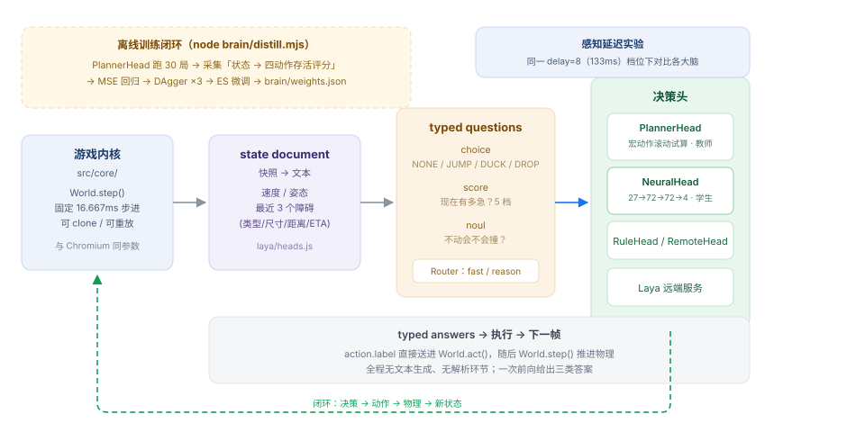

# Laya-T-Rex Runner

**A 5k-parameter model learns to play Chrome's T-Rex runner, driven by Laya's typed-decision paradigm.**

> Unofficial project: an independent implementation, not affiliated with the Laya team,
> and it ships none of their model weights.

[](README.md)
[](README.en.md)
[](assets/t-rex-runner-LICENSE)
[](#quick-start)



The game core mirrors Chromium's offline T-Rex runner line by line — gravity `0.6`,
initial jump velocity `-10`, acceleration `0.001`, speed cap `13`, the official collision-box
tables. The agent faces the *real* game, not a convenient approximation.

The decision layer generates no text and parses nothing. Every frame it renders the world
into a *state document*, asks three **typed questions** about it, takes all three answers
from a single forward pass, and feeds the chosen action straight into the physics.

---

## Contents

- [What this is](#what-this-is)
- [Quick start](#quick-start)
- [Architecture](#architecture)
- [Typed decisions: the three primitives](#typed-decisions-the-three-primitives)
- [The seven decision heads](#the-seven-decision-heads)
- [Training: teacher → student](#training-teacher--student)
- [The experiment: 133 ms of perception lag](#the-experiment-133-ms-of-perception-lag)
- [Repository layout](#repository-layout)
- [Wiring up the real Laya](#wiring-up-the-real-laya)
- [Reproducing everything](#reproducing-everything)
- [Credits and license](#credits-and-license)

---

## What this is

Every frame of the T-Rex game poses exactly one question: **which key do I press now?**
That is precisely what Laya is built for — non-autoregressive, one forward pass, emitting
only typed decisions. The model never writes a character; it returns a calibrated
distribution over four actions, plus two readouts: *how urgent is this* and
*is it safe to do nothing*.

This repository finishes that thought end to end:

| Area | What's here |
| --- | --- |
| Game core | Deterministic world with fixed-timestep stepping and `clone()` for look-ahead |
| Decision contract | `choice` / `score` / `noul` primitives, a Router, latency accounting |
| Decision heads | Analytic planner (teacher), distilled network (student), threshold rule, random baseline, remote Laya |
| Training | Collect → value regression → DAgger → evolution-strategy polish, zero dependencies, reproducible |
| Evaluation | Same-seed batch comparison at input lag 0 and 8 frames |
| Demo | Browser cockpit: per-frame typed answers, router path, forward-pass cost, decision log |

---

## Quick start

### Zero install: open the single file

Download [`dist/laya-t-rex-runner.html`](dist/laya-t-rex-runner.html) and **double-click it**.
The modules, the weights and the sprite sheets are all inlined in that one file — no Node,
no server, zero external requests at runtime.

> Why this exists: neither ES modules nor `fetch` are allowed over `file://`, so the
> source layout always needs a local server. The single-file build flattens the 14 modules
> in dependency order, converts the weights into JS literals, the sprites into data URIs
> and the evaluation worker into a Blob URL — and then a double-click is enough.

### From source

```bash
git clone <this-repo> && cd laya-t-rex-runner

# 1) Train the decision head (a few minutes the first time; writes brain/weights.json)
node brain/distill.mjs

# 2) Serve it (ES modules + fetch do not work over file://)
node tools/serve.mjs

# 3) Open http://127.0.0.1:5188/
```

Trained weights ship with the repository, so step 1 is optional.

In a hurry? Skip training: switch the brain to **LayaLite (planner)** in the cockpit —
it needs no training at all and is close to unbeatable.

You can also skip step 1 entirely. Run steps 2 and 3, and the page will tell you the
neural weights are missing; planner, threshold rule and random remain selectable.

### Building the single file yourself

```bash
npm run bundle          # writes dist/laya-t-rex-runner.html
npm run verify:bundle   # three-layer self-check: structure / syntax / behaviour
```

---

## Architecture

```
World.step()  ──►  state document  ──►  typed questions  ──►  Router  ──►  decision head
     ▲                                                                          │
     └────────────────  World.act(answer.action)  ◄──  typed answers  ◄─────────┘
```

All three typed questions go out **together**, not one after another — that is the point
of Laya's single forward pass:

```js
// src/laya/heads.js
buildQuestions()
```

The Router dispatches on how many frames remain until the nearest obstacle. Far away, it
takes the cheap path; only up close does it pay for a full rollout. `meta.path` reports
`fast` or `reason` honestly, and the cockpit shows the split.

---

## Typed decisions: the three primitives

| Primitive | Question | Answer shape | Meaning here |
| --- | --- | --- | --- |
| `choice` | Which key this frame? | 4-way probability | `NONE` / `JUMP` / `DUCK` / `DROP` |
| `score` | How urgent is this? | Expected level, normalised to 0..1 | How far away the collision is |
| `noul` | Is the current input safe? | P(true) | Collision-free for 30 frames, answered by actually simulating |

The four actions map directly onto keyboard semantics (`src/core/world.js`):

- `JUMP` — hold the up key. **How long you hold it decides how high you go.**
- `NONE` — release; upward velocity is clamped to `-5`, so a tap is a low hop.
- `DUCK` — hold the down key; while airborne this triggers a fast fall instead.
- `DROP` — fast fall only, no ducking.

> The release-to-cut-the-jump mechanic is the first trap. Press and release immediately and
> you will not clear the very first cactus. Anything that claims to play this game without
> modelling that mechanic is not playing this game.

---

## The seven decision heads

| Brain | Kind | Forward pass | Notes |
| --- | --- | --- | --- |
| `random` | Baseline | ~0.005 ms | Uniform over four keys; the floor |
| `rule` | Hand-written | ~0.005 ms | Explainable thresholds, minimal baseline |
| `neural` | Learned | ~0.01 ms | 27→72→72→4 network, distilled from the planner |
| `planner` | Analytic | ~0.10 ms | Clones the world and rolls out candidate plans — the teacher |
| `layalite` | Hybrid | ~0.05 ms | Router + planner (the full pipeline) |
| `layalite-neural` | Hybrid | ~0.01 ms | Router + neural head: a System 1 at almost zero cost |
| `laya-remote` | Remote | ~40–60 ms | POSTs to `laya_service`, answered by the real Laya |

The planner works by **macro rollout**: it clones the world and evaluates candidate plans
(jump after 0/6/12/20/30 frames of waiting, holding for 4/9/15/22 frames, ducking for 18/40,
fast-falling in mid-air...), scores each by how many frames it survives, executes the first
action of the winner, and replans on the next frame. It needs no training and is close to
invincible, but every decision simulates hundreds of frames — which is why it cannot keep
up in a browser at full speed.

---

## Training: teacher → student

```bash
node brain/distill.mjs --episodes 24 --dagger 3 --delays 0,8
```

| Step | What happens | Why |
| --- | --- | --- |
| 1 Collect | Planner plays 24 episodes; record *(state → four survival scores)* every frame | The teacher is accurate but cannot run at 60 fps |
| 2 Regress | MSE-fit the score vector; policy = `argmax` | **The key design choice** — see below |
| 3 DAgger | Student plays; teacher re-scores the states it visits; retrain | Removes compounding error |
| 4 ES | Evolution-strategy polish against the actual survival score | Recovers the last bit of timing precision |
| 5 Evaluate | Same-seed comparison of all brains, written to `brain/report.json` | Conclusions must be bit-reproducible |

**Why regression and not classification.** Imitating "which action did the teacher pick"
can reach very high frame accuracy — but accuracy is not skill. The right frame to press
jump is one or two frames wide, so the decision boundary is razor-thin, and 86% of frames
are labelled "do nothing": most of that accuracy is just "never press anything".

"How many frames do I survive if I jump now", by contrast, is **smooth** in a small
neighbourhood. Same scale, same data, same network, same DAgger and ES budget — only the
objective changes:

| Objective | Agreement with teacher | Mean @ 0 frames | Mean @ 8 frames | ES fitness @ 8 |
| --- | --- | --- | --- | --- |
| Classification (cross-entropy, class-weighted) | **96.4%** | 1402 | 967 | 688 |
| **Regression (MSE)** | 77.2% | **1985** | **3362** | 1062 (capped) |

Nineteen points *less* agreement, 1.4× the score at zero lag and 3.5× the score at 8 frames
of lag. That is the quantified case for imitating the *value* rather than the *decision*.

Both reports ship in the repository: `brain/report.json` (regression) and
`brain/report-cls.json` (classification).

> `node brain/ablation-target.mjs` is the fast way to see the trend (10 episodes,
> 30 epochs). At that scale the noise is large and the gap shrinks to roughly 1.1× —
> which is itself the point: **a small-scale ablation is not enough to settle this**,
> so the table above uses the full pipeline's scale.

---

## The experiment: 133 ms of perception lag

Human reaction time is roughly 130 ms — 8 frames. Add a `reactionDelay`: the brain only
sees the frame from 8 steps ago, while commands still take effect immediately.

Training uses `x = observe(state_{T-8})` and `y = teacher's action scores at state_T` —
that is, *"given a stale picture, infer what should happen right now"*.

| Brain | Forward pass | Mean @ 0 frames | Crash @ 0 frames | Mean @ 8 frames | Crash @ 8 frames |
| --- | --- | --- | --- | --- | --- |
| `random` | 0.005 ms | 41 | 100% | 41 | 100% |
| `rule` | 0.004 ms | 5888 (capped) | **0%** | 206 | 100% |
| `planner` | 0.100 ms | 5888 (capped) | **0%** | 46 | 100% |
| `neural` (trained per lag) | 0.017 ms | 1985 | 100% | **3362** | 83% |
| `layalite` (router + planner) | 0.061 ms | 5888 (capped) | **0%** | 46 | 100% |
| `layalite-neural` (router + neural) | 0.017 ms | 1985 | 100% | 3208 | 100% |

> Six episodes per setting and a 20000-frame cap, so the capped score is 5888. Numbers come
> from `brain/report.json` and can be recomputed independently with `node brain/bench.mjs`.

How to read it:

- **At zero lag a hand-written rule is already enough.** You can wait until the obstacle
  enters the viewport and still react in time, so learning buys nothing here — `neural`'s
  1985 is far behind the rule's capped 5888.
- **The moment lag appears, rule and planner both collapse.** The rule reacts only to what
  it sees, so it is 8 frames late; the planner does worse still (206 → 46), because it plans
  precisely against stale state, and precise planning of the wrong instant is confident and
  wrong. It is also 25× more expensive per decision.
- **Only the student trained for anticipation survives.** 3362 at 8 frames of lag — 16× the
  rule and 73× the planner — at 0.017 ms per forward pass.

This is Laya's thesis reproduced on a dinosaur: when latency is the bottleneck, a
specialised fast System 1 beats general slow reasoning — and it does so with ~5k parameters
and a forward pass under 0.02 ms.

---

## Repository layout

```
laya-t-rex-runner/
├── index.html                 Browser demo (game canvas + AI cockpit)
├── package.json
├── src/
│   ├── core/
│   │   ├── constants.js       Official constants, collision boxes, sprite coords
│   │   ├── rng.js             Reproducible RNG (replaces upstream Math.random)
│   │   ├── collision.js       AABB test, line-for-line from upstream
│   │   ├── world.js           Deterministic core: step / act / clone / snapshot
│   │   └── renderer.js        Canvas sprite renderer + collision-box debug overlay
│   ├── laya/
│   │   ├── typed-decision.js  LayaLite runtime: three primitives, Router, latency meter
│   │   ├── heads.js           State document, question templates, five decision heads
│   │   ├── features.js        State → 27-dim feature vector
│   │   └── nn.js              Minimal MLP (forward + Adam backprop), no dependencies
│   ├── brains.js              Brain registry
│   ├── autopilot.js           Observe → ask → decide → act loop
│   ├── bench.js               Headless batch evaluation
│   ├── bench.worker.js        Evaluation runs in a Worker so the UI stays responsive
│   └── ui.js                  The cockpit
├── brain/
│   ├── distill.mjs            Collect → regress → DAgger → ES → evaluate
│   ├── ablation-target.mjs    Ablation: imitate the action vs imitate the value
│   ├── bench.mjs              Recompute the comparison table from existing weights
│   ├── weights.json           Regression head, delay = 0
│   ├── weights-delay8.json    Regression head, delay = 8
│   ├── weights-cls*.json      Classification head (ablation control)
│   ├── report.json            Full report for the regression pipeline (source of all numbers)
│   └── report-cls.json        Full report for the classification pipeline
├── laya_service/              The real Laya behind an HTTP endpoint
├── tools/
│   ├── serve.mjs              Zero-dependency static server
│   ├── bundle.mjs             Flattens the whole site into one HTML file
│   └── verify-bundle.cjs      Structure / syntax / behaviour self-check of the bundle
├── dist/
│   └── laya-t-rex-runner.html Single-file demo, double-click to run (zero external requests)
└── assets/                    Sprite sheets, architecture diagram, upstream license
```

---

## Wiring up the real Laya

See [`laya_service/README.md`](laya_service/README.md).

```bash
pip install -r laya_service/requirements.txt
python laya_service/server.py --model convaiinnovations/laya

# It also starts without laya installed: falls back to the threshold rule and
# says so in the `engine` field rather than pretending to be the model.
python laya_service/server.py
```

Then pick **Laya remote** in the cockpit. The game now issues one HTTP request per frame,
and a forward pass plus round trip costs 40–60 ms — 16 to 25 decisions per second, against
the 60 the game needs. **That gap is the argument**: general inference is expensive, which
is why you distil it into a System 1 that fits inside a frame budget.

---

## Reproducing everything

```bash
# Full training + evaluation, both lag settings
node brain/distill.mjs --episodes 24 --dagger 3 --delays 0,8

# Training only, no ES polish
node brain/distill.mjs --no-es

# Compare objective functions
node brain/distill.mjs --target cls
node brain/distill.mjs --target value
node brain/ablation-target.mjs

# Every tunable
node brain/distill.mjs --episodes 40 --epochs 60 --hidden 96 --keep-none 0.25
```

The core is deterministic: same seed plus same action sequence equals a bit-identical
episode. Every score in `brain/report.json` can therefore be recomputed independently.

---

## Credits and license

- The game core and sprite sheets are ported from
  **[wayou/t-rex-runner](https://github.com/wayou/t-rex-runner)**, itself extracted from
  Chromium's offline error page. Original copyright The Chromium Authors; license text in
  [`assets/t-rex-runner-LICENSE`](assets/t-rex-runner-LICENSE).
- The decision paradigm and the `typed decisions` vocabulary (`choice` / `score` / `noul`)
  come from **[NandhaKishorM/laya](https://github.com/NandhaKishorM/laya)**
  (`convaiinnovations/laya`; weights live on HuggingFace). This repository ships **none of
  its weights** — only the interface contract and the routing/latency semantics are aligned.
  Everything under `src/laya/` is an independent lightweight implementation; use
  `laya_service/` when you want the real model.
- The rest is MIT.
