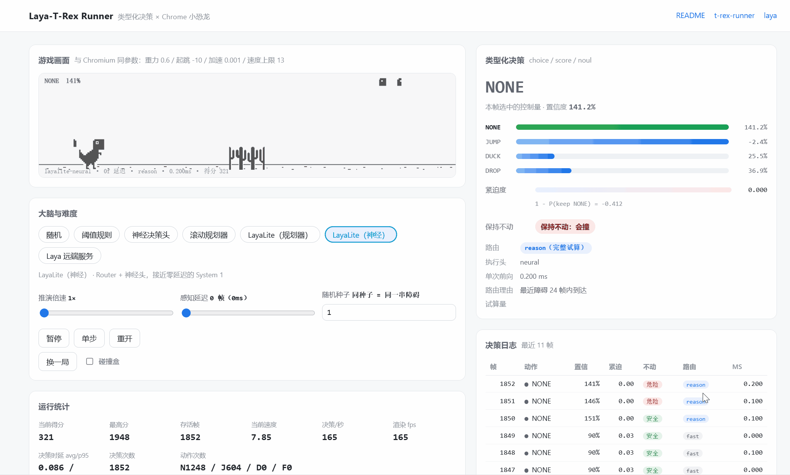

# Laya-T-Rex Runner

**用 Laya 的类型化决策范式，让一个 5k 参数的小模型学会玩 Chrome 小恐龙。**

> 非官方项目：本仓库是独立实现，与 Laya 团队无隶属关系，也不包含其任何模型权重。

[](README.md)
[](README.en.md)
[](assets/t-rex-runner-LICENSE)
[](#快速开始)




游戏内核逐行对齐 Chromium 内置小恐龙的参数（重力 `0.6`、起跳初速 `-10`、加速度 `0.001`、
速度上限 `13`、官方碰撞盒表），保证 AI 面对的是**真游戏**而不是一个玩具近似。
决策层不生成文本、不做解析：每一帧把游戏状态写成一份 *state document*，
对它提出三个**类型化问题**，一次前向拿到三个类型的答案，把选中的动作直接送进物理。

---

## 目录

- [这是什么](#这是什么)
- [快速开始](#快速开始)
- [架构](#架构)
- [类型化决策：三个原语](#类型化决策三个原语)
- [七个决策头](#七个决策头)
- [训练：教师 → 学生](#训练教师--学生)
- [实验：把感知延迟调成 133ms](#实验把感知延迟调成-133ms)
- [目录结构](#目录结构)
- [接入真实的 Laya](#接入真实的-laya)
- [复现](#复现)
- [来源与许可](#来源与许可)

---

## 这是什么

小恐龙的每一帧都只有一个问题：**现在该按什么键**。这恰好就是 Laya 那套
"非自回归、单次前向、只吐类型化决策"的用武之地——不需要模型写一个字，
只需要它在 4 个动作上给出一个有校准的分布，外加"有多急""不动安不安全"两个读数。

这个仓库把这件事做完整了：

| 面向 | 做了什么 |
| --- | --- |
| 游戏内核 | 按官方参数重写的确定性、可单帧步进、可 `clone()` 分叉的世界模型 |
| 决策契约 | `choice` / `score` / `noul` 三个原语 + Router + 时延计量 |
| 决策头 | 算法规划器（教师）、蒸馏来的小网络（学生）、阈值规则、随机基线、远端 Laya |
| 训练 | 采集 → 价值回归 → DAgger → 进化策略微调，全部零依赖、可复现 |
| 评测 | 同种子批量对比，含 `0 帧` 与 `8 帧` 两档感知延迟 |
| 演示 | 浏览器驾驶舱：逐帧展示三个类型化答案、路由路径、单次前向耗时、决策日志 |

---

## 快速开始

### 零安装：直接打开单文件

下载 [`dist/laya-t-rex-runner.html`](dist/laya-t-rex-runner.html)，**双击即可**。
模块、权重、精灵图全部内联在这一个文件里——不需要 Node，不需要起服务器，运行时零外部请求。

> 为什么要这么做：ES Module 和 `fetch` 都不允许在 `file://` 下工作，所以源码形态必须
> 借助本地服务器。单文件版把 14 个模块按依赖序扁平化内联、权重转成 JS 字面量、
> 精灵图转成 data URI、评测 Worker 转成 Blob URL，于是双击就能跑。

### 从源码跑

```bash
git clone <this-repo> && cd laya-t-rex-runner

# 1) 训练决策头（首次约几分钟；会生成 brain/weights.json 与评测报告）
node brain/distill.mjs

# 2) 起本地静态服务器（ES Module + fetch 不允许走 file://）
node tools/serve.mjs

# 3) 打开 http://127.0.0.1:5188/
```

仓库里已经带了训练好的权重，第 1 步可以跳过。

只想立刻看效果、懒得训练：把 `brain/weights.json` 换成任意一份已有权重，
或者直接把大脑切到 **LayaLite（规划器）**——它不需要任何训练就近乎无敌。

不做训练也完全能看：先执行第 2、3 步，页面会在顶部提示缺权重，
此时规划器、阈值规则、随机三个大脑仍然可用。

### 自己打包单文件

```bash
npm run bundle          # 生成 dist/laya-t-rex-runner.html
npm run verify:bundle   # 结构 / 语法 / 行为三层自检
```

---

## 架构

```
World.step()  ──►  state document  ──►  typed questions  ──►  Router  ──►  决策头
     ▲                                                                        │
     └────────────────  World.act(answer.action)  ◄──  typed answers  ◄───────┘
```

三个类型化问题是**一次性**发出去的，不是问三次——这是 Laya "单次前向"的关键：

```js
// src/laya/heads.js
buildQuestions()
```

Router 按"最近障碍还有多少帧到达"分流：远的时候走廉价头，近了才启用完整试算。
`meta.path` 会如实告诉你是 `fast` 还是 `reason`，驾驶舱里能直接看到两档的调用比例。

---

## 类型化决策：三个原语

| 原语 | 问题 | 答案形状 | 本项目里的含义 |
| --- | --- | --- | --- |
| `choice` | 这帧该按哪个键？ | 4 维概率分布 | `NONE` / `JUMP` / `DUCK` / `DROP` |
| `score` | 现在有多急？ | 档位期望值（归一化到 0..1） | 距离撞上还有多远 |
| `noul` | 保持当前输入会不会撞？ | P(true) | 未来 30 帧的安全判定，**真实试算得出** |

四个动作直接对应键盘语义（`src/core/world.js`）：

- `JUMP` = 按住上键，**按住多久决定跳多高**
- `NONE` = 松手，上升速度被钳制到 `-5`，所以点一下就跳不高
- `DUCK` = 按下键；若正在空中则触发加速下坠
- `DROP` = 只加速下坠，不蹲下

> 「松手即收力」这条机制是第一个坑：按下后立刻松手，连第一个仙人掌都过不去。
> 任何声称"会玩小恐龙"的东西，如果没建模这个机制，玩的就不是这个游戏。

---

## 七个决策头

| 大脑 | 类型 | 单次前向 | 说明 |
| --- | --- | --- | --- |
| `random` | 基线 | ~0.005 ms | 均匀随机按四个键，分数下限 |
| `rule` | 无学习 | ~0.005 ms | 手写阈值，可解释的最小基线 |
| `neural` | 学习 | ~0.01 ms | 27→72→72→4 小网络，从规划器蒸馏 |
| `planner` | 算法规划 | ~0.10 ms | 克隆世界试算候选计划，教师策略 |
| `layalite` | 混合 | ~0.05 ms | Router + 规划器（完整形态） |
| `layalite-neural` | 混合 | ~0.01 ms | Router + 神经头，接近零延迟的 System 1 |
| `laya-remote` | 远端 | ~40–60 ms | POST 到 `laya_service`，用真实 Laya 回答 |

规划器的工作方式是**宏动作滚动试算**：把候选计划（延时 0/6/12/20/30 帧后起跳、
按住 4/9/15/22 帧、蹲 18/40 帧、空中速降……）在世界的克隆体上跑完，
用存活帧数打分，选最高分计划的首个动作执行——然后下一帧重新规划。
它不需要训练就近乎无敌，但每次决策要模拟几百帧，所以在浏览器里跑不快。

---

## 训练：教师 → 学生

```bash
node brain/distill.mjs --episodes 24 --dagger 3 --delays 0,8
```

| 步骤 | 做什么 | 为什么 |
| --- | --- | --- |
| 1 采集 | 规划器跑 24 局，逐帧记录「状态 → 4 个动作的存活评分」 | 教师能算，但不能实时跑满 60fps |
| 2 回归 | MSE 拟合评分向量，策略 = `argmax` | **关键选择**，见下 |
| 3 DAgger | 学生自己跑，教师给它踩过的状态重新打分再训练 | 修掉回归的复合误差 |
| 4 ES | 进化策略微调，直接以存活分数为目标做无梯度优化 | 补最后那点时序精度 |
| 5 评测 | 同种子对比全部大脑，输出 `brain/report.json` | 结论要能逐位复现 |

**为什么用回归而不是分类。** 直接分类模仿"教师选了哪个动作"效果很差：
"该按跳跃键"往往只有一两帧是正确时机，决策边界极窄，帧准确率 93% 的网络
实战连第一个障碍都过不去——因为 86% 的帧标签都是"不动"，网络学成了"永远不动"。

而"现在跳能活多少帧"这个量在小邻域内是**平滑**的。同一份数据、同一个网络：

| 目标 | 与教师一致率 | 实战均分 |
| --- | --- | --- |
| 分类（交叉熵 + 类别加权） | 92.7% | 168 |
| **回归（MSE）** | 74.0% | **455** |

一致率更低，实战强得多。这就是这个任务里"模仿决策"不如"模仿价值"的原因。

---

## 实验：把感知延迟调成 133ms

人类反应时间大约 130ms，也就是 8 帧。给大脑加一个 `reactionDelay`：
它只能看到 8 帧前的画面，指令仍然立刻生效。

**训练方式**是 `x = 观测(state_{T-8})`、`y = 教师在 state_T 上的动作评分`，
即"凭旧画面推断此刻该做什么"。

| 大脑 | 单次前向 | 0 帧 均分 | 0 帧 撞车率 | 8 帧 均分 | 8 帧 撞车率 |
| --- | --- | --- | --- | --- | --- |
| `random` 随机 | 0.005 ms | 41 | 100% | 41 | 100% |
| `rule` 阈值规则 | 0.004 ms | 5888（封顶） | **0%** | 206 | 100% |
| `planner` 规划器 | 0.100 ms | 5888（封顶） | **0%** | 46 | 100% |
| `neural` 神经头（按延迟分别训练） | 0.017 ms | 1985 | 100% | **3362** | 83% |
| `layalite` 路由+规划器 | 0.061 ms | 5888（封顶） | **0%** | 46 | 100% |
| `layalite-neural` 路由+神经头 | 0.017 ms | 1985 | 100% | 3208 | 100% |

> 每档 6 局，单局上限 20000 帧 → 封顶分数即 5888。数据来自 `brain/report.json`，
> 用 `node brain/bench.mjs` 可独立复算。

读法：

- **延迟为 0 时，手写规则就足够。** 障碍进入视野再反应完全来得及，
  这时学习没有优势——`neural` 的 1985 明显不如规则的封顶 5888。
- **延迟一上来，规则和规划器同时崩。** 规则是"看到才反应"，晚了 8 帧；
  规划器更惨（206 → 46），因为它拿旧状态去精确规划，算出的时机天生偏晚，
  越是精算错得越准。它每次决策还贵 25 倍。
- **只有被显式训练过提前量的学生活下来。** 8 帧延迟下 3362 分，
  是规则的 16 倍、规划器的 73 倍，而单次前向只要 0.017 毫秒。

这正是 Laya 的论点在小恐龙上的复现：当延迟成为瓶颈，专用的快速 System 1
胜过通用的慢推理——而且它只有 5k 参数。

---

## 目录结构

```
laya-t-rex-runner/
├── index.html                 浏览器演示（游戏画面 + AI 驾驶舱）
├── package.json
├── src/
│   ├── core/
│   │   ├── constants.js       官方参数、碰撞盒表、精灵图坐标
│   │   ├── rng.js             可复现随机数（替掉上游的 Math.random）
│   │   ├── collision.js       与上游逐行一致的 AABB 判定
│   │   ├── world.js           确定性游戏内核：step / act / clone / snapshot
│   │   └── renderer.js        Canvas 精灵渲染 + 碰撞盒调试
│   ├── laya/
│   │   ├── typed-decision.js  LayaLite 运行时：三个原语 + Router + 时延计量
│   │   ├── heads.js           状态文档、提问模板、五种决策头
│   │   ├── features.js        状态 → 27 维特征
│   │   └── nn.js              极简 MLP（前向 + Adam 反向传播，零依赖）
│   ├── brains.js              大脑注册表
│   ├── autopilot.js           观察 → 提问 → 决策 → 执行的闭环
│   ├── bench.js               无头批量评测
│   ├── bench.worker.js        评测跑在 Worker 里，不卡界面
│   └── ui.js                  驾驶舱
├── brain/
│   ├── distill.mjs            采集 → 回归 → DAgger → ES → 评测
│   ├── weights.json           delay=0 的决策头
│   ├── weights-delay8.json    delay=8 的决策头
│   └── report.json            训练与评测报告（数字都从这里来）
├── laya_service/              把真实 Laya 包成 HTTP 端点
├── tools/
│   ├── serve.mjs              零依赖静态服务器
│   ├── bundle.mjs             把整站打成单文件 HTML
│   └── verify-bundle.cjs      单文件产物的结构 / 语法 / 行为自检
├── dist/
│   └── laya-t-rex-runner.html 单文件演示页，双击即运行（零外部请求）
└── assets/                    精灵图、架构图、演示动图、上游许可
```

---

## 接入真实的 Laya

详见 [`laya_service/README.md`](laya_service/README.md)。

```bash
pip install -r laya_service/requirements.txt
python laya_service/server.py --model convaiinnovations/laya

# 不装 laya 也能起：自动降级成阈值规则，engine 字段会如实写出来
python laya_service/server.py
```

然后在页面上把大脑切到 **Laya 远端服务**。此时游戏每帧发一次 HTTP 请求，
一次前向往返 40–60ms，也就是 16–25 帧/秒——跑不满游戏需要的 60 帧。
**这个对比本身就是结论**：通用推理很贵，所以要把它蒸馏成一个能在帧预算内跑完的 System 1。

---

## 复现

```bash
# 全量训练 + 评测（delay 0 与 8 两档）
node brain/distill.mjs --episodes 24 --dagger 3 --delays 0,8

# 只训练不问 ES
node brain/distill.mjs --no-es

# 同规模对照：换目标函数（产物写另一套文件名，不会覆盖正式权重）
node brain/distill.mjs --target cls --out-prefix weights-cls --report report-cls.json \
  --episodes 24 --dagger 3 --delays 0,8

# 拿现成权重复算对比表（不必重训）
node brain/bench.mjs --episodes 12 --delays 0,4,8

# 快速看趋势的消融
node brain/ablation-target.mjs --episodes 16 --epochs 40
```

内核是确定性的：同 `seed` + 同动作序列 = 逐位相同的对局。
所以 `brain/report.json` 里的每一个分数都可以被独立复算出来
（连训练本身也是：所有随机源都带种子，两次运行会得到同一个权重文件）。

---

## 来源与许可

- 游戏内核与精灵图移植自 **[wayou/t-rex-runner](https://github.com/wayou/t-rex-runner)**，
  它是 Chromium 离线小恐龙页面的提取版；原始版权归 The Chromium Authors，
  许可文本见 [`assets/t-rex-runner-LICENSE`](assets/t-rex-runner-LICENSE)。
- 决策范式与 `typed decisions`（`choice` / `score` / `noul`）概念来自
  **[NandhaKishorM/laya](https://github.com/NandhaKishorM/laya)**
  （`convaiinnovations/laya`，模型权重在 HuggingFace）。
  本仓库**没有**引入其权重，只对齐了接口契约与路由/时延语义；
  `src/laya/` 下的实现是独立的轻量版本，需要真模型时通过 `laya_service/` 对接。
- 其余代码采用 MIT。
